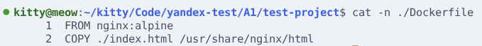
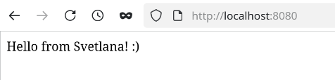
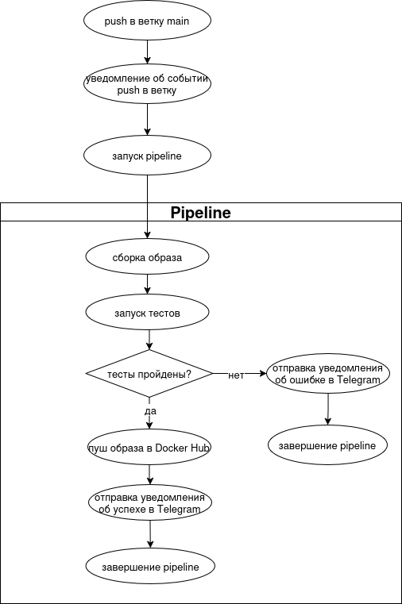

# Тестовое задание на позицию DevOps-инженер (Яндекс Браузер для организаций)

- Орлова Светлана
- [Резюме](https://drive.google.com/file/d/1yOBlVtS8oZebL31J7TNquRGH7dTKFSR4/view)
- Дата: 01.08.2026
- Репозиторий: <https://github.com/Orlovchikk/yandex-test>

## Задание A1: "Собери и запусти" (Docker, Linux, CLI)

1. Для начала была создана директория `A1/test-project` и выполнен переход в нее:

    ```bash
    mkdir -p A1/test-project && cd A1/test-project
    ```

2. После было создано два файла: `Dockerfile` и `index.html`

    ```bash
    touch Dockerfile && touch index.html
    ```

3. В `index.html` было добавлено приветственное сообщение

    ```bash
    echo "Hello from Svetlana! :)" >> index.html
    ```

4. В `Dockerfile` за основу был взят образ `nginx:alpine` и добавлена инструкция копирования файла `index.html` в специальную директорию `/usr/share/nginx/html`, из которой `nginx` берет приветственную страницу

    

5. Для сборки образа использовалась команда

    ```bash
    docker build -t my-web-app:latest .
    ```

6. Контейнер был запущен командой

    ```bash
    docker run -d -p 8080:80 my-web-app:latest
    ```

7. По адресу <http://localhost:8080> вышла следующая страница:

    

8. Также был написан `compose.yml`, который запускал один сервис `web-app`, используя Dockerfile, и открывал порт 8080, который перенаправлялся на 80 порт сервиса.

    ```text
    services:
        web-app:
            build: .
            ports:
            - 8080:80
    ```

9. Запустить `compose.yml` можно командой

    ```bash
    docker compose up -d
    ```

**Как можно доставить твой index.html в контейнер, не пересобирая образ?**

Лучше всего использовать docker volume, который монтирует папку или файл машины хоста к запущенному контейнеру. То есть если бы мы написали такой `compose.yml`:

```text
services:
    web-app:
        image: nginx:alpine
        ports:
            - "8080:80"
        volumes:
            - ./index.html:/usr/share/nginx/html/index.html:ro
```

То наш `index.html` был одним и тем же файлом на хосте и в контейнере, так что все изменения, сделанные в него, отображались бы в контейнере и были бы видны на странице <http://localhost:8080>. Но изменения работают и в обратную сторону, поэтому в строке `./index.html:/usr/share/nginx/html/index.html:ro` есть в конце `:ro`, это права доступа к файлу: `ro` означает `read only` - права только на чтение файла, чтобы приложение в контейнере не могло изменить наш изначальный файл.

## Задание B1: "Простой скрипт-помощник" (Bash)

Выполненое задание находится в файле `B1/clean_old_logs.sh`

Скрипт принимает 2 аргумента: путь к директории и количество
дней (`N`). Находит в директории все файлы с расширением `.log`, которые старше `N` дней. Дальше выводит найденные файлы и спрашивает, удалять ли их. При подтверждении удаляет, при отказе завершает работу.

## Задание B2: "Маленькая проблема в Git" (Git)

    Ситуация:

    1. Ты сделал коммиты в ветке feature/junior-task.
    2. Тебе нужно срочно переключиться на main, чтобы поправить баг, но твои текущие изменения не готовы для коммита.
    3. Как сохранить твою незакоммиченную работу, переключиться на main, а потом вернуться к ней?
    4. После возврата в feature/junior-task ты понял, что последний коммит нужно переименовать. Как это сделать?
    Задача: Напиши последовательность команд Git для решения этой ситуации.

### Решение

1. В git есть команда `stash`, которая сохраняет текущие изменения и восстанавливает изначальное содержимое файлов при последнем коммите. Поэтому первым делом использую ее: `git stash`

2. После можно спокойно переключится на ветку `main`, не боясь потерять незакоммиченные изменения. Команда: `git checkout main`

3. Сделать все изменения, добавить нужные файлы в коммит через `git add <путь к файлу, папке>`

4. Сохранить коммит через `git commit -m '<сообщение коммита>'`

5. Переключится обратно на ветку `feature/junior-task` с командой `git checkout feature/junior-task`

6. Для восстановления своих изменений, которые были сохранены на шаге 1, нужно прописать команду `git stash pop`

7. Для исправления сообщения предыдущего коммита используется команда `git commit --amend -m '<новое сообщение>'`

8. Если предыдущий коммит был выгружен в удаленный репозиторий, то после переименования нужно прописать команду `git push -f`, чтобы исправить историю в удаленном репозитории.

## Задание B3: "Объясни концепцию" (Понимание CI/CD)

    Представь, что тебе нужно настроить автоматическую сборку Docker-образа из кода в репозитории.

    1. Нарисуй схему (блок-схему) или опиши текстом по шагам, что должно происходить, когда разработчик пушит код в ветку main в GitLab/GitHub.
    2. Включи в схему этапы: "запуск тестов", "сборка образа", "пуш образа в Docker Hub", "уведомление в Telegram об успехе/провале".

Итоговая схема



Объяснение по шагам:

1. Сначала разработчик отправляет свои изменения в удаленный репозиторий через `git push`

2. После этого срабатывает pipeline, у которого обозначено, что он должен запускаться при событии push в ветку main

3. Далее у pipeline'а есть несколько стадий:
    1. Сначала собирается docker образ, для того, чтобы уже на поднятом приложении тестировать, хотя есть тесты (unit, linter), которые нужно проводить до этой стадии.
    2. После запускаются тесты (интеграционные), если тесты не прошли, то отправляется уведомление о неудачном pipeline в Telegram и выполнение pipeline завершается, если же тесты успешны, то происходит переход к следующей стадии.
    3. Образ отправляется на Docker Hub. На этой стадии образ тегируется и выгружается на реестр контейнеров. На этой стадии также отправляются уведомления об успешном pipeline в Telegram
